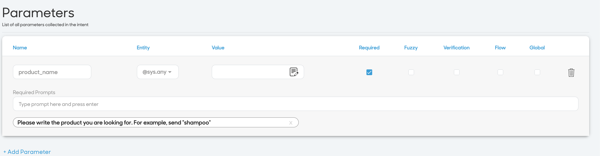

## Introduction
Where is the closest Tesco supermarket? What are the tea brands sold at Tesco? 

If you ever lived in the UK, you would have liked someone to ask the above questions. What if you can do it via WhatsApp?

This blog post will help you integrating **Tesco API** with **Nexmo Messages API** and **Over AI Bot**.

## Prerequisities

#### Tesco API

Tesco Labs (https://devportal.tescolabs.com/) offers three main APIs: 

- **Grocery Search**: returns matching grocery products based on search terms provided.
- **Store Location**: returns the closest groceries based on location and additional filters
- **Product Data**: returns product data given the `EAN Code` or `Tesco Product Number`

We will use the first two APIs, Grocery Search and Store Location. 

*Getting a Tesco API Key is not a process which completes instantly, it will take almost one week. Currently, the service is in Beta status.*

#### OverAI

**OverAI** is an AI voice Bot for enterprise. The core of the solution is an artificial intelligence (AI) powered voice agent, which is built on over.ai's proprietary Natural Language Understanding (NLU) algorithms to enable a conversational interaction.

I will use the Natural Language Understanding (**NLU**, https://docs.over.ai/rest-apis-and-references/untitled) API to control the flow and the responses of the conversation in WhatsApp.

#### Nexmo Messages

Nexmo Messages API supports native app features and multimedia messaging-including video, audio, and geolocation-so your brand can deliver a more engaging user experience. You can use Messages API to help your business to get in touch with customers on the channel that’s most convenient for them. Or, you can send a notification that surprise and delight your users, such as reminders, booking confirmation, etc.

For this demo, I choose to use WhatsApp for Business (https://developer.nexmo.com/messages/concepts/whatsapp).

## Why build a chatbot? 

Chatbots are extremely valuable for businesses and this value will only increase as time goes by. Chatbots can be used to improve Customer Experience and Customer Engagement. Chatbots are easy to use and many customers prefer them over calling a representative on the phone because it tends to be faster and less invasive. They can also save money for companies and are easy to set up.

### Flow of conversation 

**User**: Hello.

**Nexmo Messages Inbound Webhook**: the inbound webhook allows to send the text to OverAI Engine.

**OverAI Agent**: A module within OverAI which incorporates NLU to understand what the user meant and to figure out what “action” has to be carried out. The agent transforms the user request into machine-readable actionable data.

**Intent**: Intents contain the core base of the conversation. The intent section is where you will create and include the knowledge and training for your agent. Each intent includes caller utterances, the agent’s response, contexts, parameters, and webhooks.

https://docs.over.ai/tutorials/the-developers-platform/intents

### Create the conversation

The bot will be able to find the nearest shop around a certain location and to give information about products sold by Tesco shops.

Let's create three intents: 

- **welcome**: this is the welcome message to send to the user. It contains the message with the options available. The intent is composed of a few utterances such as *hi, hello, etc* and a sample response with the instruction on how to use the bot.
- **location**: this intent will ask the users' location to get the nearest shop. The location intent is triggered by a few expressions (such as where is the closest shop?). The response is simple: could you share your location, please?
- **product**:  this intent will ask the name of the product to get the product requested. This intent as a parameter request, the product name. This parameter is **required**, which means that the bot will prompt to insert a product name. 

### Integration between OverAI and Nexmo Messages API

Nexmo Messages API offers a webhook to get inbound messages from WhatsApp. Leveraging that, we get the text sent by the customer via WhatsApp and push it to OverAI NLU. The process is the following:

  
**Welcome Message:** if the user sends a general welcome message (such as Hi or Hello), the bot reply is straight forward. We get the text from Over Ai response and we sent it back to the user using Nexmo Messages API.

**Location Request:** if the user asks for the nearest Tesco branch, we need to process the request calling Tesco API - Store Location. Unfortunately, Tesco API gets as an input only `zipcode` and not longitude and latitude as locations. I used `node-geocoder` to transform longitude and latitude from WhatsApp location to Zip Code to send to Tesco API.

Once obtained the closest shop, I send the message back to the user in a Media Template form. The Media Template WhatsApp Message is composed of a rich media (such as images, location or video) and a text. In this case, I am using Location + Text.

**Product Request:** if the customer requests information about a product, we need to split the conversation into two parts. The first message will be the text that invokes the product intent. Then, since we defined the product name as a required parameter in the intent, the bot will reply with the prompt defined in the parameter section. Once the user sends the product name, we need to query the Product Tesco API. For test purposes, I limit the products responses to one. 
The response contains information about the products such as image, name, price, quantity, etc. I decided to use the image, name and price and send back a message with the product image and caption composed by product name and price. The result is the following:

// [todo] image

// [todo] video

### Conclusion

So what did we learn in this post?

We created an integration between OverAI bot and Nexmo Messages (WhatsApp). 
We created three main intents and pull data from an external API (Tesco API) to enable the bot to reply with additional information.

This flow can be implemented and integrated with any external API so the use cases are infinite! 

Repo: 
 